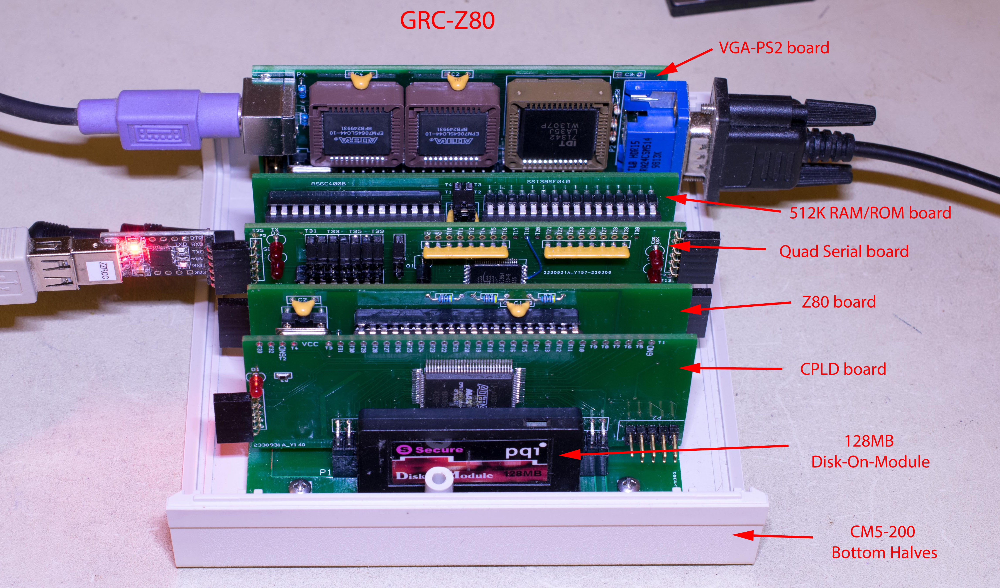

# GRC-Z80
Generic Retro Computer (GRC) is a modular system for 8-bit (and some 16-bit) processors of 1970's and 1980's.  GRC-Z80 is based on Z80 while shares common backplane, RAM/Flash, CPLD, CF disk, I/O and video boards

